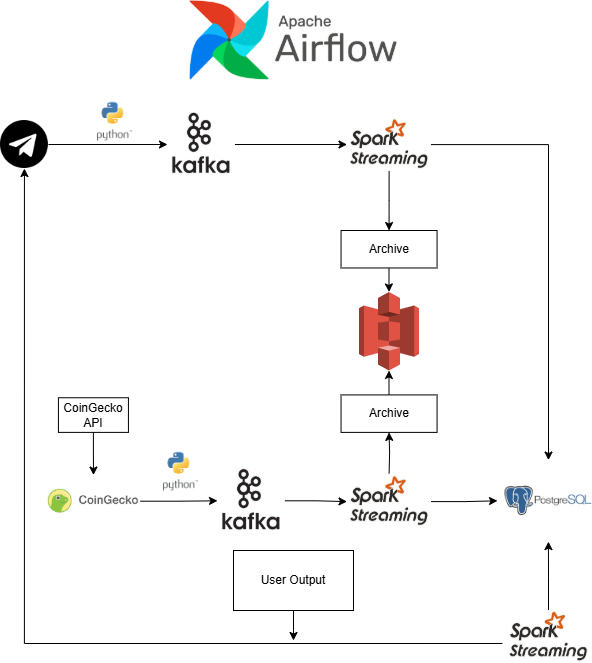

# 🪙 Real-Time Crypto Alert System

This project is a real-time crypto alert system built as a final project for the Big Data Engineering course at Naya College. It integrates user-defined price alerts for cryptocurrencies with streaming market data to send real-time Telegram notifications. The solution leverages **Apache Kafka**, **Apache Spark Streaming**, **Apache Airflow**, **PostgreSQL**, and **MinIO (S3-compatible)** for a complete end-to-end data pipeline.

---

## 📌 Project Overview

### 🔹 Goal:
Allow users to define alert thresholds for cryptocurrency prices through a Telegram bot. If the live price meets the conditions (e.g., drops below or rises above a target), the system sends an alert back to the user in real-time.

---

## ⚙️ Architecture



### Components:
- **Telegram Bot** – Receives user alerts and pushes them into Kafka.
- **Kafka** – Handles streaming for both user messages and live coin prices (API).
- **Airflow** – Schedules API data pulls and cleanup jobs.
- **Spark Streaming** – Streams and processes data from Kafka to PostgreSQL and MinIO, and also returns the processed user output to the Telegram Bot.
- **PostgreSQL** – Stores structured alert and price data.
- **MinIO (S3)** – Archives historical records in Parquet format.
- **Docker Compose** – Orchestrates all services in containers.

---

## 🧩 Services in `docker-compose.yaml`

| Service          | Role |
|------------------|------|
| `dev_env`        | Spark container for running streaming jobs |
| `airflow_webserver` & `scheduler` | Workflow orchestration |
| `postgres`       | Main database |
| `minio`          | S3-compatible object storage |
| `course-kafka` & `zookeeper` | Kafka message broker |
| `kafdrop`        | Kafka UI for message inspection |
| `mongo`, `nifi`, `elasticsearch`, `kibana`, `trino` | Additional ecosystem support (not primary) |

---

## 🧠 Key Scripts

### Pipeline 1:

### `telegramBot_to_kafka.py`
- Receives user input from Telegram.
- Publishes to Kafka topic: `telegram_message_data`.

### `stream_crypto_alerts.py`
- Consumes `telegram_message_data` from Kafka.
- Parses and stores user-defined alerts into PostgreSQL (`crypto_alerts`) and MinIO.

### Pipeline 2:

### `coinGecko_to_kafka_dag.py`
- Airflow DAG triggered every 5 minutes.
- Pulls price data from CoinGecko API.
- Sends market data to Kafka topic: `crypto_price_data`.

### `stream_coin_price.py`
- Consumes `crypto_price_data` from Kafka.
- **Overwrites** `crypto_market_data` in PostgreSQL (ensures freshness).
- **Appends** data in MinIO for long-term storage.

### Pipeline 3:

### `alert_user_realtime.py`
- Runs continuously in Spark Streaming.
- Joins `crypto_alerts` and `crypto_market_data`.
- Sends Telegram alerts based on alert conditions and updates `is_alerted` flag.

### Cleanup DAG Script:

### `cleanup_crypto_alerts_dag.py`
- Airflow DAG - removes records from the `crypto_alerts` table that have already been sent to the Telegram Bot, using the `is_alerted` flag as a reference.


---

## 🧪 Running the Project

### 1. Start the environment
```bash
docker-compose up -d
```

### 2. Run a Spark job (e.g., stream alerts)
```bash
docker exec -it dev_env bash
export PYSPARK_SUBMIT_ARGS="--packages org.apache.spark:spark-sql-kafka-0-10_2.12:3.4.0,org.postgresql:postgresql:42.6.0,org.apache.hadoop:hadoop-aws:3.3.4 pyspark-shell"
python3 /opt/airflow/stream_crypto_alerts.py
```

> ℹ️ You need to export `PYSPARK_SUBMIT_ARGS` **every time** before running Spark scripts inside the container.

---

## 📂 Data Flow Summary

1. **User sends alert** → Telegram bot → Kafka → PostgreSQL + MinIO  
2. **Airflow DAG** fetches market data from CoinGecko → Kafka  
3. **Spark** ingests market data → PostgreSQL (overwrite) + MinIO (append)  
4. **Spark job** joins alert rules + market data → Sends alert via Telegram  
5. **Cleanup DAG** removes old `is_alerted=true` rows from `crypto_alerts`  

---

## ✅ Final Notes

- PostgreSQL stores only **the latest** crypto market data.
- Historical data is safely archived in **MinIO** using **Parquet** format.
- Fully containerized system replicates real-world streaming + alerting pipelines.

---

## 📎 Credits
Developed by **Gilad Shai** & **Gal Sagi**  
As part of the **Naya College Final Project – Cloud & Big Data Engineering Course**
